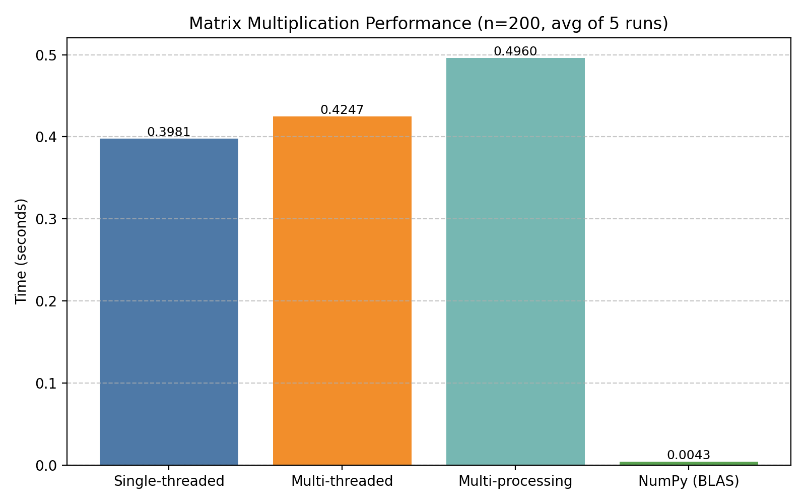

# Matrix Multiplication Benchmark

This project benchmarks different approaches to **matrix multiplication in Python**:

- **Single-threaded Python** (naive triple loop)
- **Multi-threaded Python** (GIL-bound demo, limited speedup)
- **Multi-processing** (parallel workers)
- **NumPy vectorized (BLAS)**

It compares execution times and speedup ratios, and generates both a **summary table** and a **plot**.

---

## Features
- Benchmarks multiple implementations side by side  
- Prints results in a clear table format  
- Saves a performance plot as `perf_summary.png`  
- Demonstrates Python’s **GIL limitations** and the power of **vectorization**  

---

## Requirements

Install dependencies:

```bash
pip install -r requirements.txt
```

Contents of `requirements.txt`:
```txt
numpy
matplotlib
```

---

## Usage

Run the benchmark:

```bash
python matrix_benchmark.py
```

Example results (n=200, averaged over 5 runs):

```
Single-threaded:     0.41s
Multi-threaded:      0.43s  (~0.96×, limited by GIL)
Multi-processing:    0.25s  (~1.6× faster)
NumPy (BLAS):        0.004s (~94× faster)
```

The script also generates a plot:



---

## Key Insights
- Python **threads** do not speed up CPU-bound loops due to the **Global Interpreter Lock (GIL)**  
- **Multiprocessing** gives real parallelism but introduces communication overhead  
- **NumPy (BLAS)** is orders of magnitude faster thanks to optimized C/Fortran libraries  

---

## License
MIT License — feel free to fork, use, and adapt.

---

## Acknowledgements
- [NumPy](https://numpy.org/)  
- [Matplotlib](https://matplotlib.org/)  
